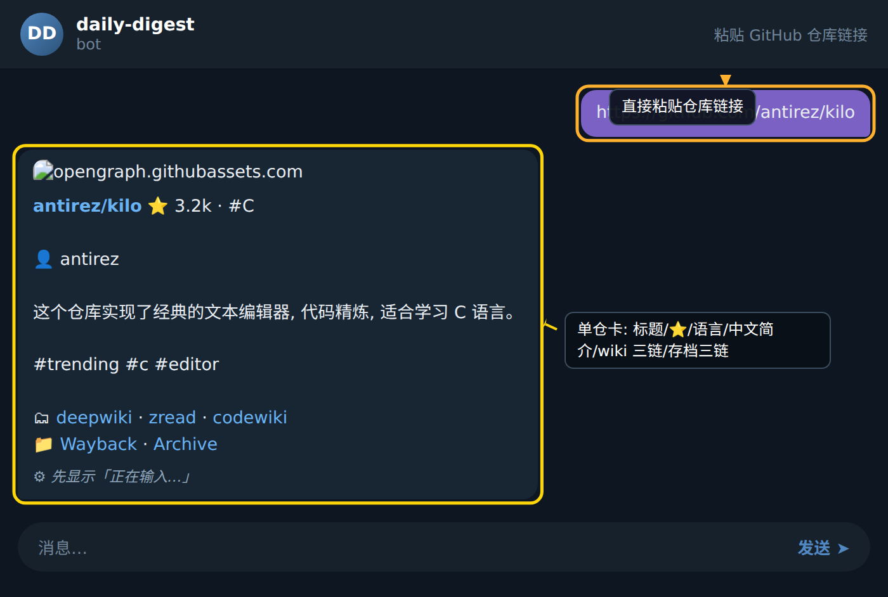

## 单仓查询

通过粘贴 GitHub 仓库链接,可以快速获取仓库元数据、归档记录以及 AI 生成的描述卡片。本节按首次查询和重复查询两种场景,逐步演示完整操作流程。

### 步骤 1: 复制仓库链接

在浏览器或 GitHub App 中找到目标仓库,复制其 URL。链接格式必须为 `https://github.com/owner/repo`,例如 `https://github.com/antirez/kilo`。目前 Bot 仅识别根仓库地址,暂不支持子目录或单文件路径。

### 步骤 2: 发送到 Bot

将链接作为消息正文发送给 Bot,无需附带任何额外指令。Bot 会自动识别 URL 格式并触发仓库查询流程。

### 步骤 3: 查看返回的归档卡片

Bot 在处理完成后,会返回一条带描述的归档卡片。卡片内容包含仓库名称、星标数、话题标签( `#` 开头 )以及 AI 生成的简介。例如查询 `antirez/kilo` 时,Bot 会返回如下内容:

> antirez/kilo ⭐ 3.2k · #C 👤 antirez 这个仓库实现了经典的文本编辑器, 代码精炼, 适合学习 C 语言。 #trending #c #editor 🗂

卡片末尾的 🗂 符号后附带归档链接,点击即可跳转到完整存档页面,查看该仓库的历史快照与元数据记录。

### 步骤 4: 区分首次与重复查询

Bot 内部会根据仓库是否已存在归档记录来走不同分支:

- **首次查询**: Bot 会调用 GitHub API 抓取仓库元数据(名称、星标、语言、作者等),同时请求 deepwiki 与 zread 服务生成中文简介,再写入存档数据库,最后组装卡片回复。整个流程通常需要数秒。
- **重复查询**: Bot 检测到已有归档记录后,会跳过抓取与 AI 描述生成步骤,直接读取已有数据组装卡片,因此响应更快。用户可在卡片中看到 ♻️ 标记,表示该条目来自历史归档。

### 步骤 5: 点击归档链接

卡片中 🗂 后的链接指向 Bot 的归档页面,可查看该仓库的完整描述、抓取时间戳以及历次查询记录。归档数据会持续累积,便于后续追溯。

## 小贴士

- 粘贴链接时确保 URL 完整,缺少协议头(如 `github.com/owner/repo`)会导致 Bot 无法识别。
- 如果返回的描述不够准确,可以在归档页面查看原始元数据,或等待 deepwiki/zread 服务重新生成。
- 批量查询多个仓库时,建议逐条发送,避免短时间内高频请求触发限流。
