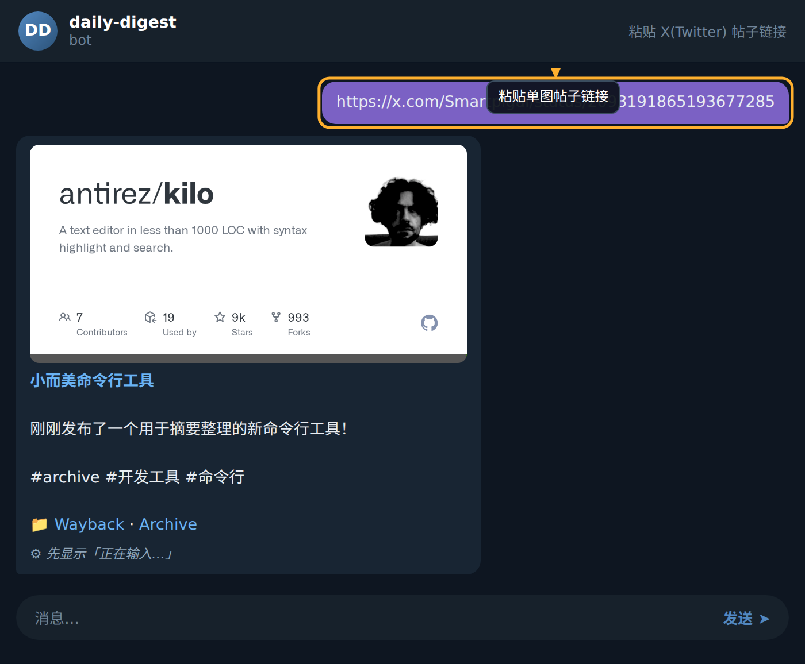
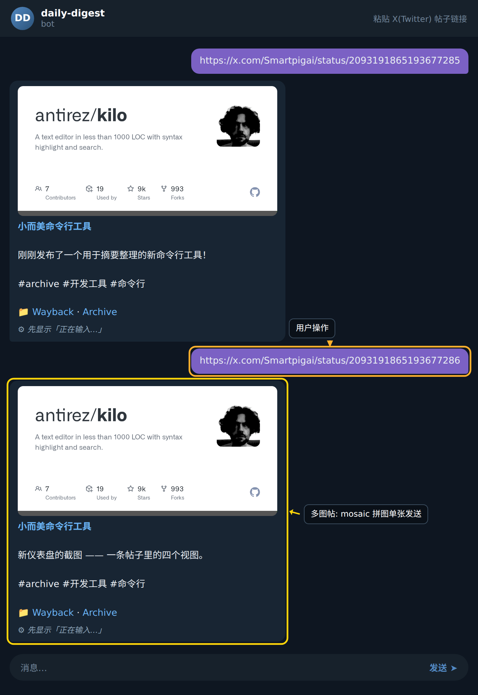

### 步骤 1：粘贴 X 帖链接

在 Bot 对话框中直接发送一条 X(Twitter)帖子的完整链接,形如 `https://x.com/<用户名>/status/<帖ID>`。无需添加任何额外命令或前缀,Bot 会自动识别为存档请求。发送后请耐心等待数秒,Bot 正在调用 FxEmbed v2 拉取原帖内容(含文本、图片、视频信息)。

### 步骤 2：接收存档卡片

Bot 会回复一张卡片,内容包含三个层次:

1. **翻译正文**:原帖文本的中文翻译结果,并保留话题标签(如 `#archive #开发工具 #命令行`)。
2. **媒体区**:如果原帖包含图片,会以多图 mosaic(拼接)形式展示在卡片中;若包含视频则显示视频预览;若为纯文字帖,则只展示文字。
3. **底部链接**:末尾会附带 📁 图标及一个 `https://web.archive.org/...` 开头的 Web Archive 永久备份链接,方便日后回溯。

如截图所示,Bot 已成功将第一条链接的文本翻译并附上了 Archive 备份链接。

### 步骤 3：发送第二条链接验证批量处理

继续粘贴另一条 X 帖链接,例如 `https://x.com/Smartpigai/status/2093191865193677286`。Bot 会以同样的流程处理——拉取、翻译、生成 Telegraph 页面、回传卡片,无需等待上一条完成。

如截图所示,Bot 对第二条链接同样返回了包含翻译正文和 Archive 链接的卡片,卡片布局会根据内容自适应(此例为单图配文)。

### 步骤 4:确认归档完成

每次成功存档后,卡片末尾的 Archive 链接即为该帖的永久快照地址,你可以将其收藏或转发。如果对翻译结果不满意,可点击卡片查看 Telegraph 完整页的原文对照。

### 小贴士

- **保持链接完整**:务必复制包含 `https://` 协议头的完整 URL,仅粘贴数字 ID 会无法识别。
- **多图帖正常处理**:一条帖子内最多支持 4 张图片的 mosaic 拼接展示,超过部分仍可在 Telegraph 完整页中查看。
- **失败重试**:若 Bot 长时间无回复(超过 30 秒),可能是 X 端网络波动,直接重新粘贴一次链接即可,Bot 会从头开始存档流程。
