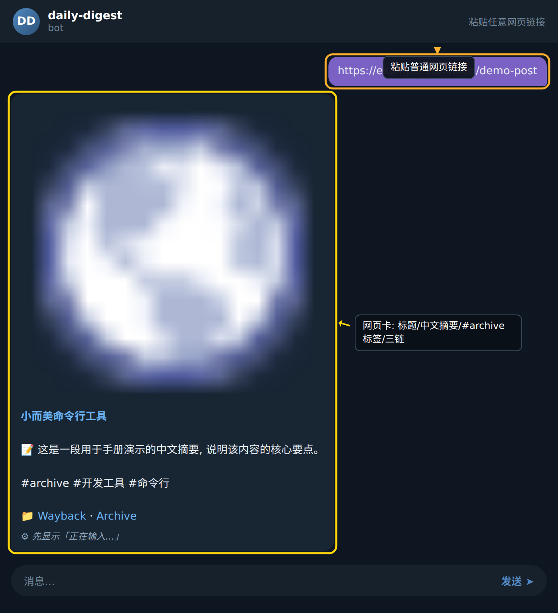

### 步骤 1:粘贴网页链接

在对话窗口中直接粘贴任意普通 URL(无需添加任何命令或前缀)。发送后,Bot 会立即开始抓取与解析流程。

### 步骤 2:等待 Bot 自动生成存档卡片

Bot 在后台完成三件事:抓取网页正文并转换为 markdown、将内容同步推送到 GitHub 仓库与 Telegraph 平台、最终回传一张汇总卡片。卡片包含三部分信息:

- 标题:从网页正文中提炼的核心主题。
- 摘要:用一段中文概括内容的核心要点(并非原文截取,而是 Bot 重新生成)。
- 标签与链接区:正文末尾附上 `主题标签`(`#主题1 #主题2` 形式),以及 `📁` 前缀的三链导航区,分别指向 GitHub 存档、Telegraph 阅读页、archive.org 历史快照,方便在不同场景下查阅。

示例回执:

> 小而美命令行工具 📝 这是一段用于手册演示的中文摘要,说明该内容的核心要点。 #archive #开发工具 #命令行 📁 GitHub 存档 · Telegraph 阅读页 · archive.org 快照

效果如下图所示:

### 步骤 3:在卡片中按需点击链接

卡片底部的 `📁` 区域会同时呈现三个跳转链接,各自用途不同:

- **GitHub 存档**:适合长期归档与版本追溯,内容以 markdown 文件形式存储在仓库中。
- **Telegraph 页**:即点即读,排版清爽,适合在手机端快速浏览。
- **archive.org 快照**:提供网页的历史版本访问,在原站失效时尤为有用。

用户可根据使用场景选择其中任意一个链接,无需再次操作 Bot。

### 小贴士

- 链接前请确认网页为公开可访问,需登录或付费墙后的内容 Bot 无法抓取。
- 摘要与标签由 Bot 自动生成,若与预期不符,可重新发送同一链接,Bot 会覆盖并重新归档。
- 为避免重复入库,建议在发送前先在 GitHub 仓库内检索标题关键词,确认是否已存在同名存档。
