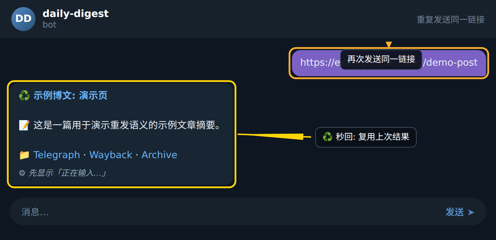

### 重复链接 — 重发语义

本章说明当你重复发送同一个链接时，Bot 如何识别并执行「重发」语义，而不是重新抓取和归档。

### 步骤 1: 发送重复链接

在 Telegram 聊天中再次向 Bot 发送之前已经处理过的链接，例如 `https://example.com/blog/demo-post`。Bot 会先查询本地存档，判断该链接是否已有完整记录。

### 步骤 2: Bot 返回重发消息

Bot 检测到链接已在事务中标记为 `done` 状态，于是直接复用已有存档，而不会重新抓取网页或重新生成摘要。回复格式与首次归档消息保持一致，仅在最前面使用重发标记。

### 步骤 3: 核对标题、摘要与三链

请确认 Bot 返回的内容是否同时包含三类信息：

- **标题**：例如「示例博文: 演示页」
- **摘要**：例如「📝 这是一篇用于演示重发语义的示例文章摘要。」
- **三链**：Telegraph 直链，以及其它两个配套链接（按你配置决定）

如果三项齐全，则表示命中的是 `done` 状态的完整存档。下方插图为该场景下的实际效果：

### 步骤 4: 区分其他重发分支

需要留意的是，重发行为并非只有一种：

- 若上次事务为 `done`，Bot 直接重发标题、摘要、三链，不重跑抓取流程；
- 若上次事务为 `retry`（即上次处理不完整），Bot 会先提示「🔁 正在重试」再重新抓取与归档；
- 若是更早的老记录、没有任何存档，Bot 视为新链接处理，会重新抓取并补齐三链。

重复发送同一个链接时，可根据回复前缀快速判断走的是哪条分支。

### 小贴士

- 想要确认一条链接是否已被 Bot 收录过，只需再发一次，观察是否出现 ♻️ 标记即可。
- 若你期望的是「重新抓取最新版本」而不是重发旧摘要，可删除旧存档或使用 Bot 提供的强制刷新指令，而不是单纯重复粘贴链接。
- 当返回消息缺少三链或摘要不完整时，说明该链接走的是 `retry` 或老记录分支，此时应等待 Bot 完成重跑，不要再次重复发送以免重复触发。
