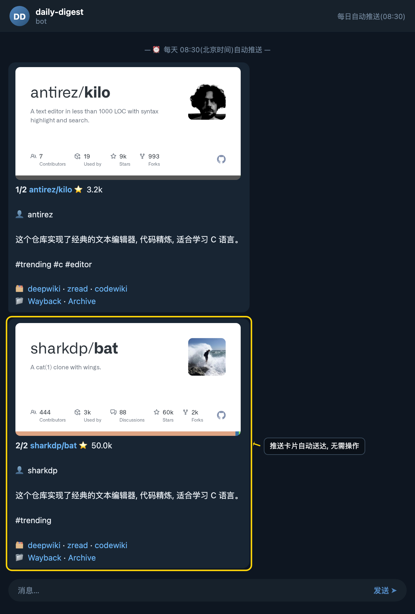

### 每日自动推送（cron）

本章介绍每天 08:30（北京时间）由 Bot 后台定时任务自动执行的全流程：抓取最新趋势项目、AI 翻译为中文、追加存档，并将摘要主动推送到你的聊天窗口。整个过程无需任何手动操作，到点即收。

### 步骤 1：等待定时触发

保持与 Bot 的对话窗口开启即可。每天 08:30（北京时间），后端的 cron 调度器会自动唤醒执行链路，依次启动新鲜抓取、翻译、存档、推送四个阶段，以及日常维护任务（如 refreshLookupDescriptions、backfillDescriptions）。此时你无需发送任何指令，只需留意聊天窗口的更新。

### 步骤 2：接收自动推送的项目摘要

cron 触发完成后，Bot 会按编号顺序逐条推送当日精选的热门仓库，每条包含仓库名、Star 数、作者、AI 生成的中文简介以及话题标签和存档链接。例如典型输出形如：

> `1/2 antirez/kilo ⭐ 3.2k 👤 antirez 这个仓库实现了经典的文本编辑器，代码精炼，适合学习 C 语言。 #trending #c #editor 🗂 <a …>`
>
> `2/2 sharkdp/bat ⭐ 50.0k 👤 sharkdp 这个仓库实现了经典的文本编辑器，代码精炼，适合学习 C 语言。 #trending 🗂 <a href="https:…>`

格式中的 `N/总数` 表示当日推送进度，方便你直观看到还有几条即将发出。

### 步骤 3：留意异常提示

如果某一数据源暂时不可用（例如 Product Hunt 接口超时、被限流或返回异常），Bot 会在推送末尾追加一条带 ⚠️ 图标的告警，提示你该项拉取失败、可稍后再试。该告警不会阻断其他来源的正常推送，也不影响存档与维护任务的执行。你可以选择忽略，或稍后手动触发重试。

### 小贴士

- 推送内容会同时写入存档，事后可通过 `历史`、`搜索` 等指令按仓库名、话题或日期回溯，不必担心错过。
- 若长时间未收到 08:30 的推送，请先检查与 Bot 的对话是否仍在置顶或未被清理，再确认 Bot 实例的 cron 调度是否处于运行状态。
- 维护任务（refreshLookupDescriptions、backfillDescriptions）会在推送完成后静默执行，用于刷新与回填描述缓存，一般不会打扰到你。
